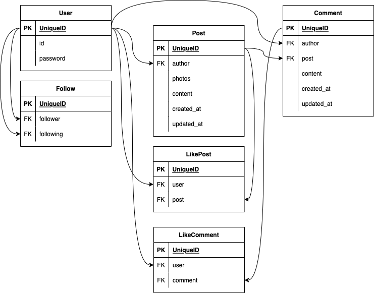

# SNS app built with IONIC

## back

## front
- Go to your new project: cd ./cns
- Run ionic serve within the app directory to see your app in the browser
- Run ionic capacitor add to add a native iOS or Android project using Capacitor
- Generate your app icon and splash screens using cordova-res --skip-config --copy
- Explore the Ionic docs for components, tutorials, and more: https://ion.link/docs
- Building an enterprise app? Ionic has Enterprise Support and Features: https://ion.link/enterprise-edition